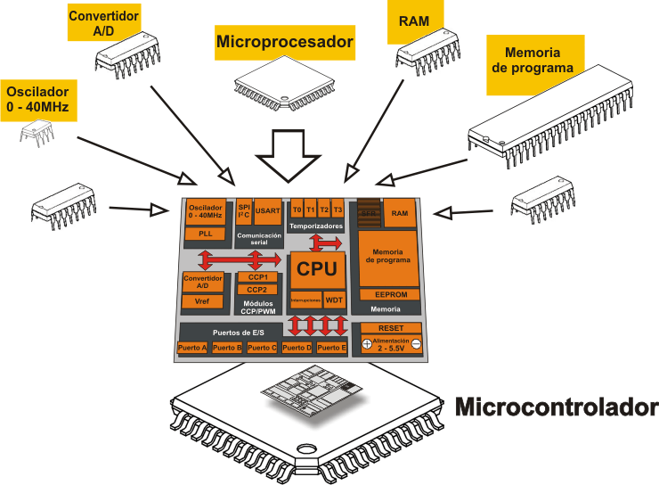

# Componentes de un procesador

---

**CPU**: Esta encargada de procesar la informacion y ejecutar las operaciones definidas por el software.  

**ALU**: Esta unidad esta dentro del CPU y esta encargada de hacer las operaciones aritmeticas y logicas necesarias para que el procesador pueda ejecutar las instrucciones de los programas.  

**Registros**: Son pequeños espacios de almacenamientos dentro de la CPU que se utilizan para guardar datos temporalmente.  

1. Registros de proposito general: Son registros que pueden ser utilizados para almacnar cualquier tipo de dato que la CPU necesite mientras pocesa instrucciones.

2. Registros especificos: Son registros que tienen una funcion definida y son utilizados por el sistema para controlar el flujo de ejecucion.  

**Unidad de control**: Es la parte de la CPU que esta encargada de coordinar y dirigir las operaciones del procesador, tomando las instrucciones de la memoria las decodifica y luego envia señales a otras partes del procesador para realizar las operaciones necesarias.  

**Buses de datos y de direccion**: Los buses son canales de comunicación dentro del sistema que permiten que los datos viajen entre los diferentes componentes del procesador y otros periféricos.

1. Bus de datos: Transmite los datos entre la CPU, la memoria y otros dispositivos.

2. Bus de dirección: Se utiliza para especificar la dirección de memoria a la que se deben enviar o recibir los datos.

**Memoria RAM**: Es una memoria volátil que almacena temporalmente los datos y las instrucciones que la CPU necesita mientras está en funcionamiento. Se borra cuando el equipo se apaga.

**Memoria ROM**: Es una memoria no volátil que contiene información que no cambia, como el firmware o el sistema básico de arranque. A diferencia de la RAM, no pierde la información cuando el dispositivo se apaga.

Aunque hoy en día existen variantes más modernas como memorias Flash y otras tecnologías, los términos RAM y ROM siguen siendo ampliamente utilizados.

**Opcode**: El opcode (código de operación) es una parte de las instrucciones que el procesador entiende. Indica qué operación debe ejecutar la CPU.